Implemenation vs Figma Desgin

1. Step 1
   Figma: 
   Implemenation: 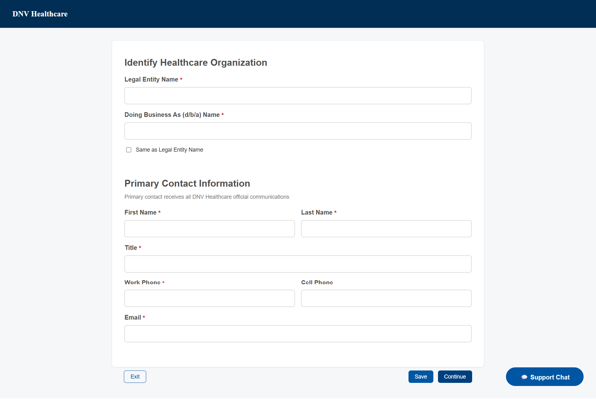

2. Step 2
   Figma: 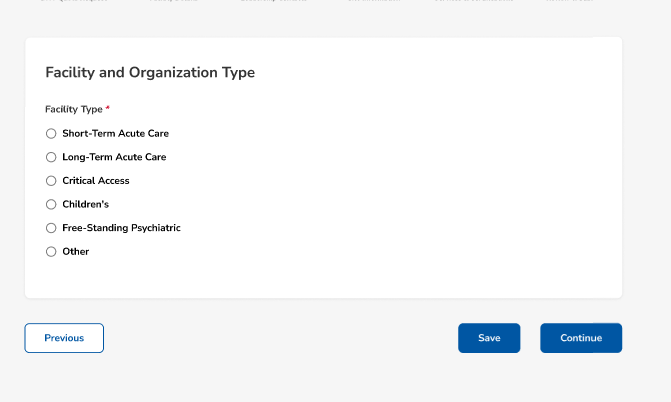
   Implemenation: 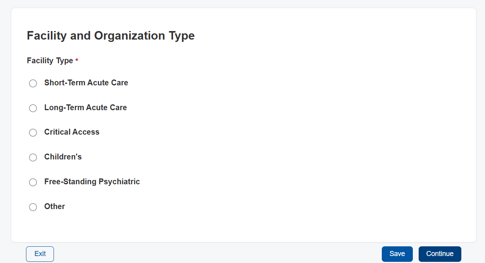

Figma: 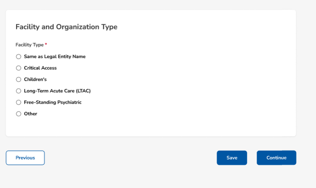
Implemenation: 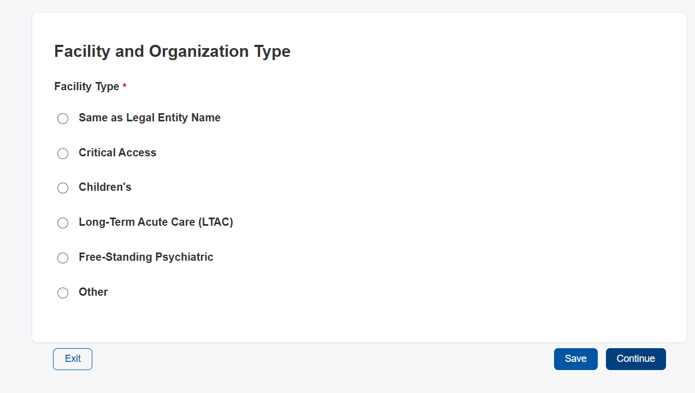

3. Step 3
   Figma: 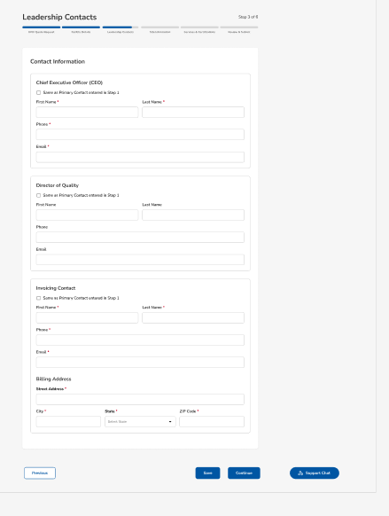
   Implemenation: 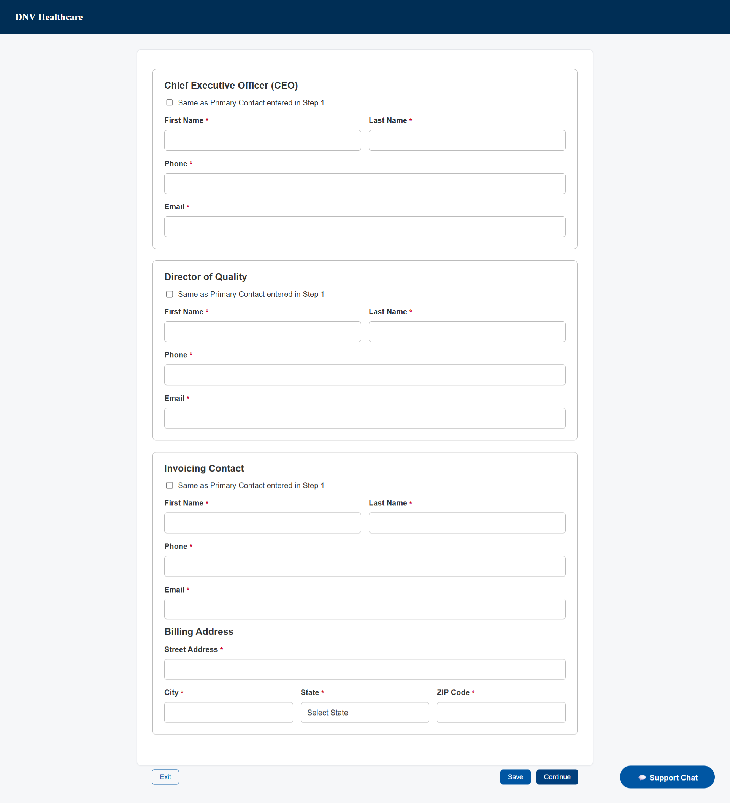

4. Step 4
   Figma: 
   Implemenation: 

5. Step 5
   Figma: 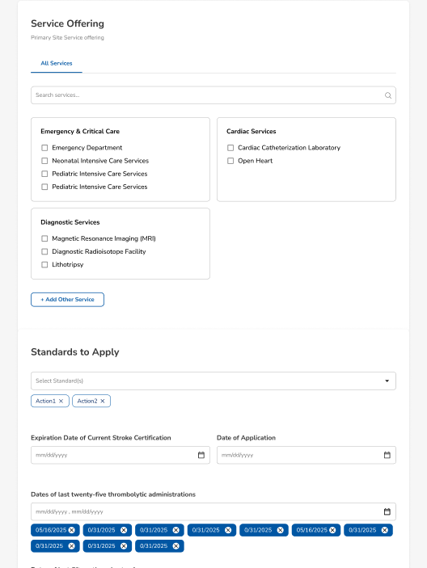
   Implemenation: 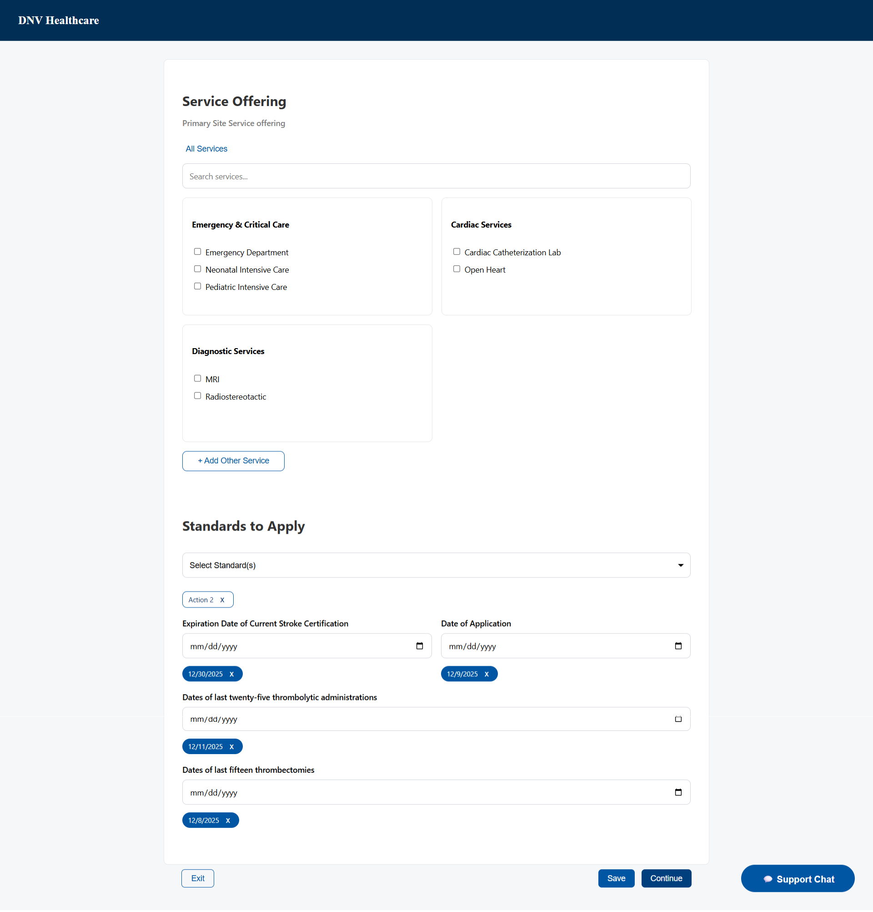
   Implemenation: 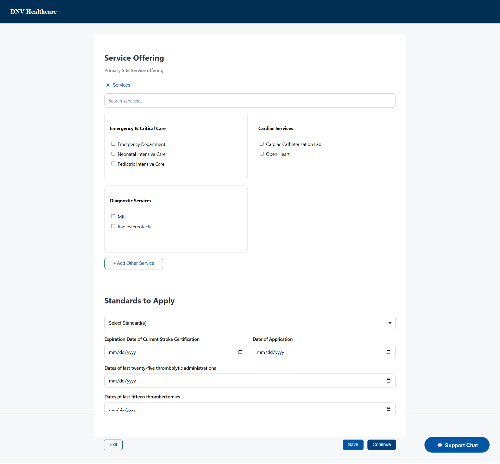

6. Review
   Figma: 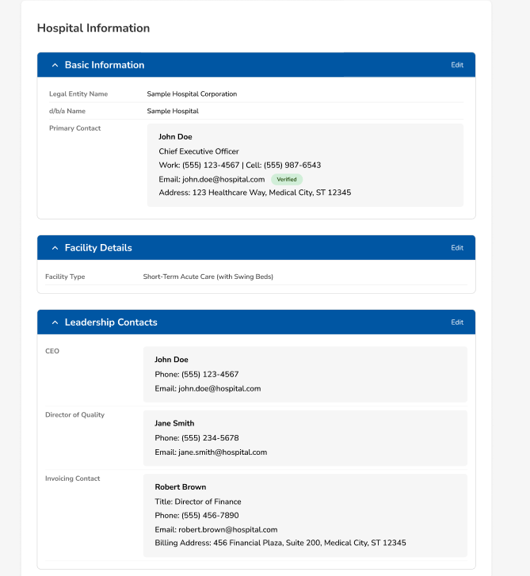
   Figma: 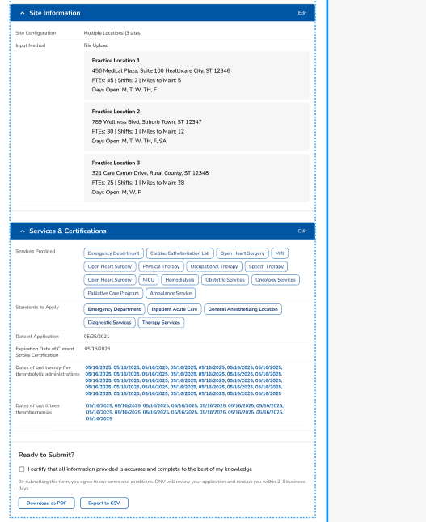
   Implemenation: 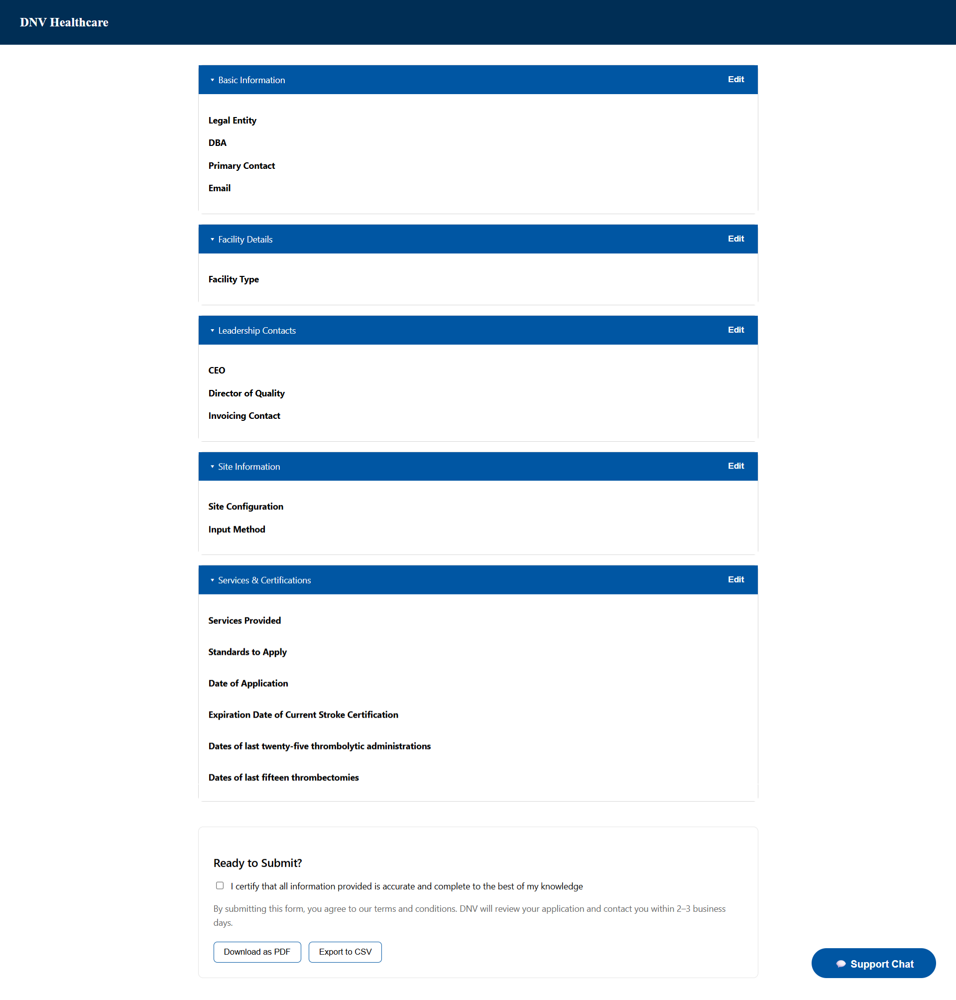

-- Pixel Measurement Notes + Accuracy Method

All layout spacings, padding, margins, and element dimensions were inspected directly from the Figma design using the Figma inspector. Values such as input heights, button widths, border radius, and spacing between form fields were applied manually in CSS.

Typography, font sizes, weights, and line heights were matched based on Figma properties.
Where exact pixel alignment was unclear or not visible in the preview, proportional values were chosen to maintain consistent visual hierarchy.

-- Design System + Spacing + Color Decisions

To maintain consistent layout implementation across components, the following design considerations were made:

A consistent spacing scale based on 4px increments (4 / 8 / 12 / 16 / 24 / 32px)

Shared padding + margin rules used across sections and buttons

Color palette extracted from Figma fill and text properties:

primary text color: #1A1A1A

primary accent / CTA blue: #1A3A70

gray border: #E5E5E5

error red: #D72638

All components use consistent 8px border-radius where defined in the design

Layout implemented using CSS flex + grid for consistent alignment and flow

These decisions were made to reflect the visual system seen in the design and ensure reusability throughout the codebase.

-- Browser Testing Performed

The UI was tested manually in modern browsers to verify layout and interaction behaviors:

Chrome — rendering matches expected layout

Firefox — layout consistent with minor font smoothing variance

Safari — layout largely consistent but spacing may vary slightly due to font rendering differences

Hover, focus, collapse/expand interactions, and navigation across steps worked identically across the browsers tested.

-- Deviations from Figma + Justification

Some deviations exist due to technical and time constraints:

Minor spacing inconsistencies may appear on certain form fields or review pills

Responsive layouts use inferred breakpoints based on desktop-first design

Default browser rendering differences affect focus outlines and text anti-aliasing

Validation/error display not fully implemented due to limited instructions

These deviations do not alter the intended visual hierarchy or navigation flow, and can be refined with additional iteration once full design specifications are provided.
